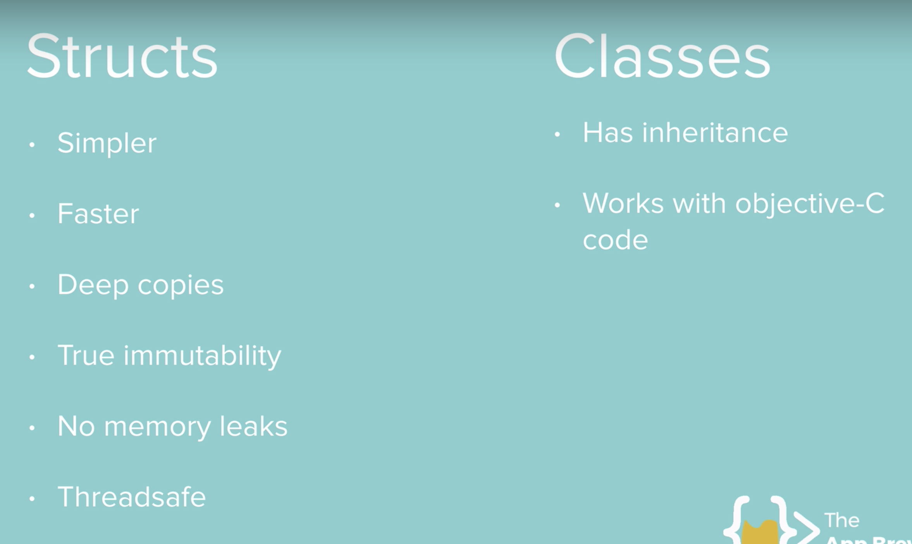

# iOS13 Swift Structs VS Classes

Section 22: Advanced Swift Classroom - Part 2

## What you will practice

first go with structs until you need inheritance (class)

>This is a companion project to The App Brewery's Complete App Developement Bootcamp, check out the full course at [www.appbrewery.co](https://www.appbrewery.co/)

